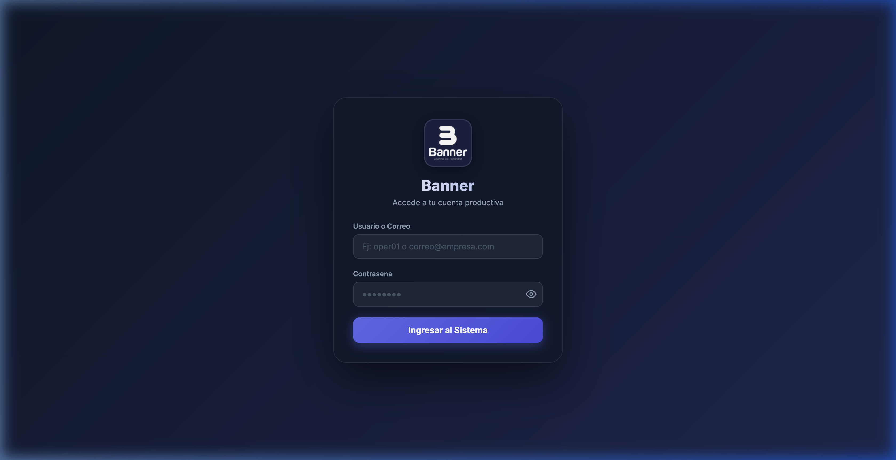
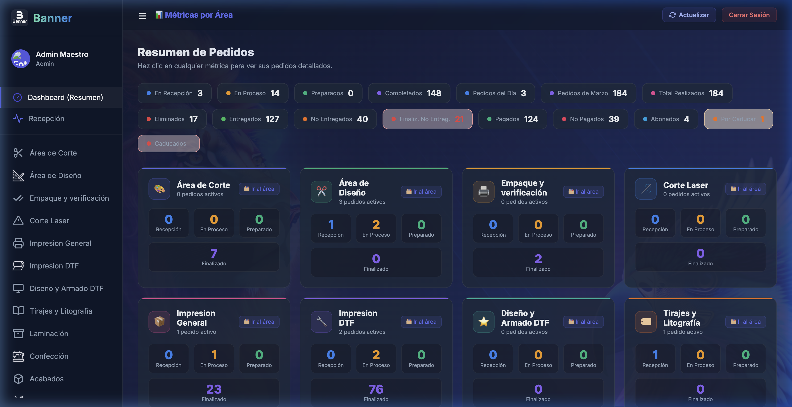
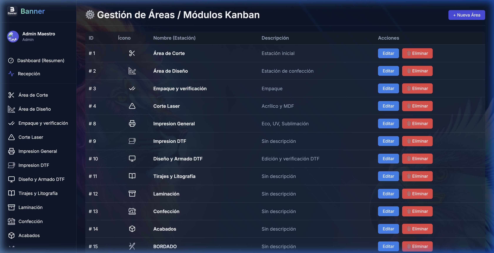
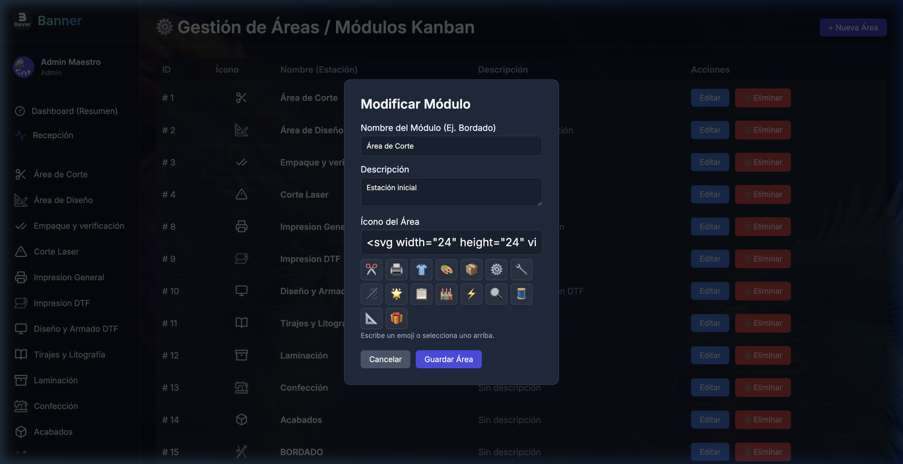

# 🚀 Banner ERP - Sistema de Gestión de Áreas y Workflows

[](https://github.com/D3C0D1/Software-ERP-Areas)
[](LICENSE)

**Banner ERP** es una solución integral de planificación de recursos empresariales (ERP) diseñada específicamente para la gestión eficiente de flujos de trabajo en entornos productivos. El sistema permite el control total sobre áreas de trabajo, pedidos, contabilidad y comunicación automatizada.

---

## 📸 Vista Previa del Sistema

### 🔐 Acceso Seguro
Diseño minimalista y profesional para el inicio de sesión.


### 📊 Dashboard Administrativo
Resumen en tiempo real de métricas, pedidos por área y estados de producción.


### ⚙️ Gestión de Áreas (CRUD)
Control total sobre los módulos de trabajo y estaciones del workflow.


### 📝 Edición de Módulos
Flexibilidad total para editar descripciones, iconos y flujos.


---

## ✨ Características Principales

- **Gestión de Áreas (CRUD):** Creación, lectura, actualización y eliminación de estaciones de trabajo (Corte, Diseño, Laser, etc.) con iconos personalizados.
- **Sistema Kanban & Workflow:** Seguimiento visual de pedidos a través de diferentes etapas de producción.
- **API de SMS e Integración de Mensajería:** Notificaciones automáticas a clientes y operarios.
- **Módulo de Contabilidad:** Seguimiento de abonos, pagos realizados y métricas financieras diarias.
- **Panel de Administración Maestro:** Control total de usuarios, roles y permisos detallados.
- **Arquitectura Robusta:** Desarrollado bajo el patrón MVC (Modelo-Vista-Controlador) para máxima escalabilidad.

---

## 📂 Estructura del Proyecto

```text
Software-ERP-Areas/
├── app/                    # Lógica del Sistema (Namespaced)
│   ├── controllers/        # Controladores de la aplicación
│   ├── models/             # Modelos de Base de Datos
│   ├── repositories/       # Capa de Acceso a Datos (Patrón Repository)
│   ├── services/           # Lógica de Negocio y APIs Externas (SMS, etc)
│   └── middlewares/        # Autenticación, CORS, etc.
├── config/                 # Configuraciones de Base de Datos y Sistema
├── docs/                   # Documentación y Recursos Visuales
│   └── assets/             # Imágenes y capturas de pantalla
├── public/                 # Directorio raíz del servidor web (Assets JS/CSS/Img)
│   ├── index.php           # Front Controller (Punto de entrada)
│   └── js/                 # Scripts de cliente y gestores de sonido
├── routes/                 # Definición de rutas del sistema (ApiRoutes.php)
├── views/                  # Vistas del sistema (PHP/HTML/CSS)
│   └── components/         # Fragmentos de UI reutilizables
├── workers/                # Scripts de tareas en segundo plano (SMS Worker)
└── storage/                # Almacenamiento temporal y logs
```

---

## 🛠️ Tecnologías Utilizadas

- **Lenguaje:** PHP 8.x
- **Base de Datos:** MySQL / MariaDB (PDO)
- **Frontend:** HTML5, Modern CSS (Glassmorphism), Vanilla JS
- **Arquitectura:** MVC Single Point of Entry
- **Integraciones:** API SMS, WhatsApp notification hooks

---

## 🚀 Instalación y Configuración

1. **Clonar el repositorio:**
   ```bash
   git clone https://github.com/D3C0D1/Software-ERP-Areas.git
   ```

2. **Configurar la base de datos:**
   - Importar el archivo `erp_mvc.sql` en tu servidor MySQL.
   - Editar `config/Database.php` con tus credenciales.

3. **Configuración del Servidor:**
   - Apuntar el DocumentRoot a la carpeta `/public`.
   - Asegurarse de tener habilitado `mod_rewrite` en Apache.

4. **Credenciales por defecto:**
   - **Usuario:** `admin@erp.com`
   - **Contraseña:** `admin123`

---

## 📡 Rutas y API

El sistema utiliza un enrutador centralizado en `routes/ApiRoutes.php`. Algunas rutas clave:

- `GET /dashboard`: Vista principal de métricas.
- `GET /admin_areas`: Panel de gestión de módulos.
- `POST /api/login`: Endpoint de autenticación.
- `GET /api/metricas`: Datos en JSON para el dashboard.

---

## 👨‍💻 Autor
**D3C0D1** - Desarrollador Principal  
📧 [ingeniero20211@gmail.com](mailto:ingeniero20211@gmail.com)

---
© 2026 Banner Software. Todos los derechos reservados.
